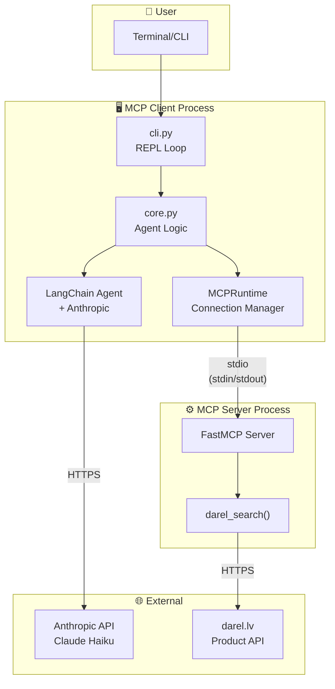
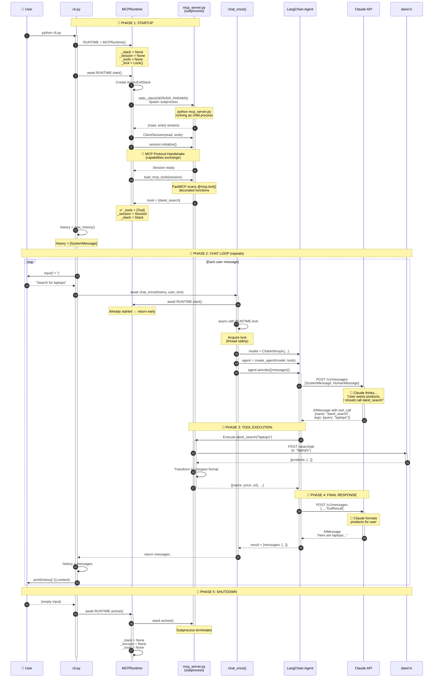
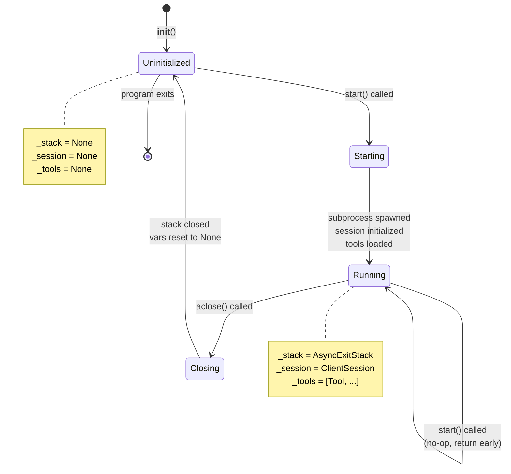
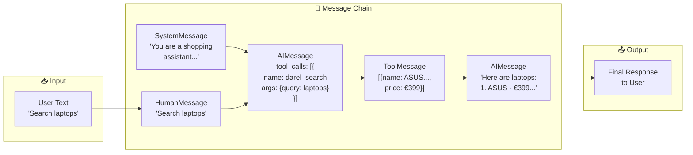
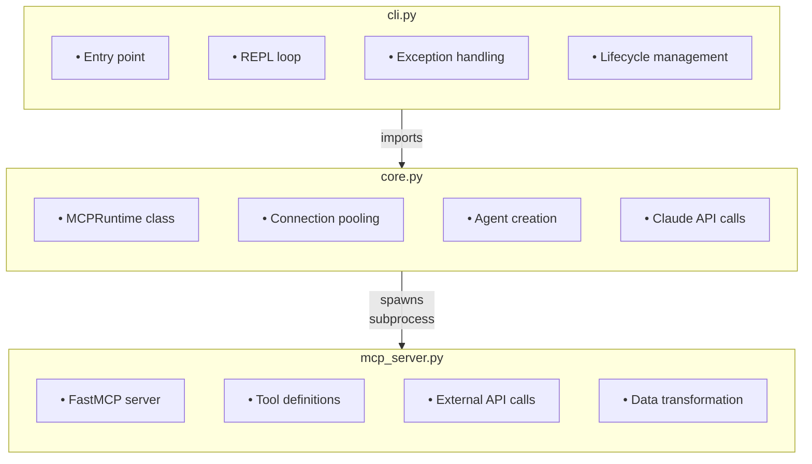
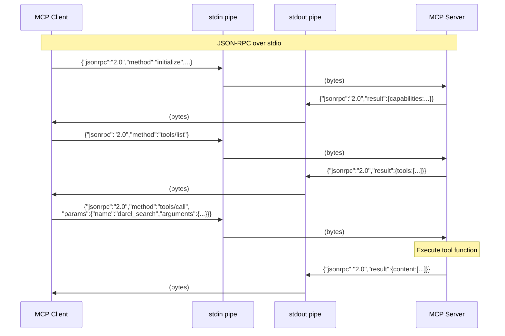
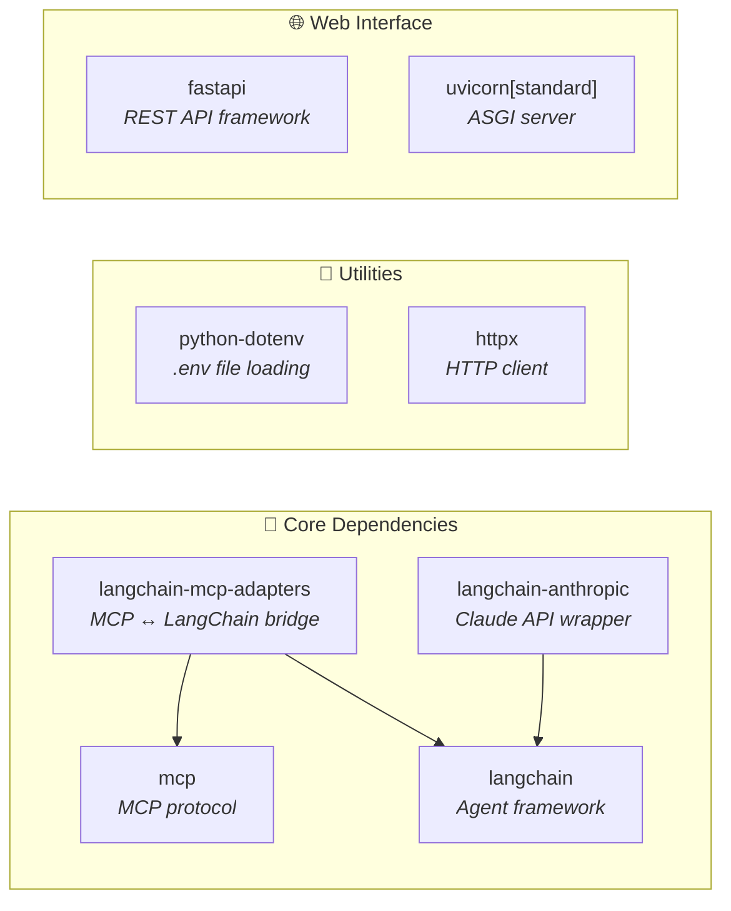
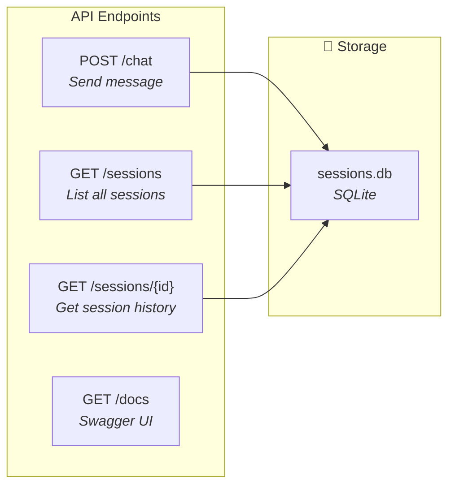
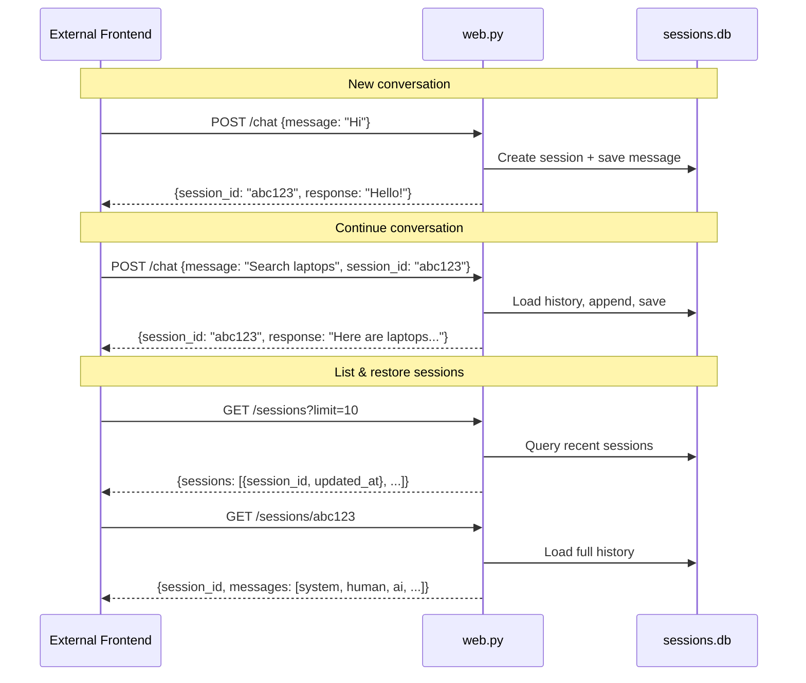

# MCP Client-Server Architecture

## High-Level Overview



---

## Detailed Sequence Diagram: Complete Flow



---

## State Machine: MCPRuntime



---

## Data Flow: Message Types



---

## Component Responsibilities



---

## IPC: stdio Communication



---

## 📦 requirements.txt Analysis



| Package | Used In | Purpose |
|---------|---------|---------|
| `httpx` | `mcp_server.py` | HTTP client for external API calls (darel.lv) |
| `mcp` | `core.py`, `mcp_server.py` | MCP protocol (ClientSession, FastMCP server) |
| `python-dotenv` | `core.py` | Load environment variables from `.env` file |
| `langchain` | `core.py` | Agent framework (`create_agent`) |
| `langchain-mcp-adapters` | `core.py` | Bridge MCP tools to LangChain (`load_mcp_tools`) |
| `langchain-anthropic` | `core.py` | Claude API integration (`ChatAnthropic`) |
| `fastapi` | `web.py` | REST API framework for web interface |
| `uvicorn[standard]` | CLI command | ASGI server to run FastAPI |

---

## 🔌 REST API Reference (web.py)



| Endpoint | Method | Description | Request | Response |
|----------|--------|-------------|---------|----------|
| `/chat` | POST | Send a message to the chatbot | `{message, session_id?}` | `{session_id, response}` |
| `/sessions` | GET | List all sessions | `?limit=100&offset=0` | `{sessions: [{session_id, updated_at}]}` |
| `/sessions/{id}` | GET | Get full conversation history | - | `{session_id, messages: [...]}` |
| `/` | GET | Built-in HTML chat UI | - | HTML |
| `/docs` | GET | Swagger/OpenAPI docs | - | HTML |

### Session Flow



---

## File Structure

```
mcp-client-server/
├── cli.py             # 🖥️  Terminal interface (python cli.py)
├── web.py             # 🌐  Web interface (uvicorn web:app)
├── core.py            # 🧠  Shared logic (MCPRuntime, chat_once)
├── mcp_server.py      # ⚙️  MCP tool server
├── session_store.py   # 💾  SQLite session storage
├── sessions.db        # 🗄️  Session database (auto-created)
├── requirements.txt   # 📦  Dependencies
├── .env               # 🔑  API keys (gitignored)
└── .env.example       # 📋  Config template
```
